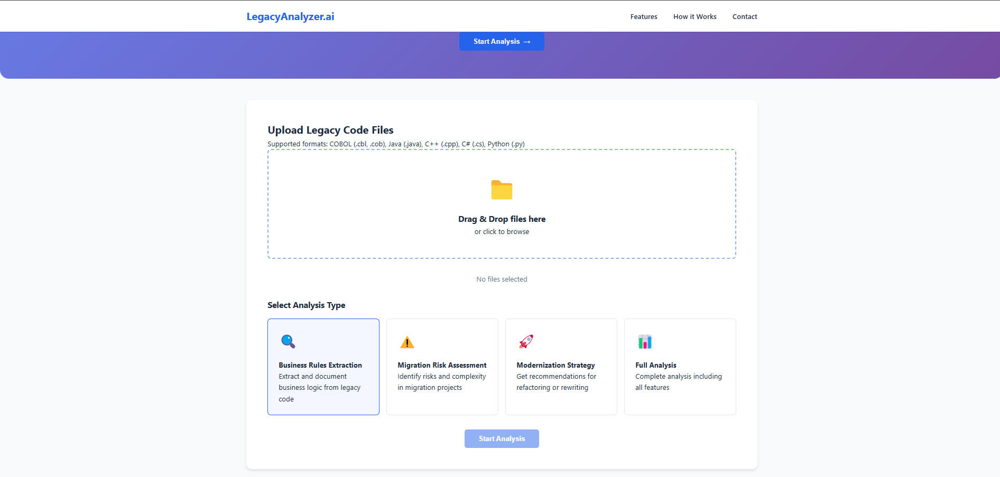
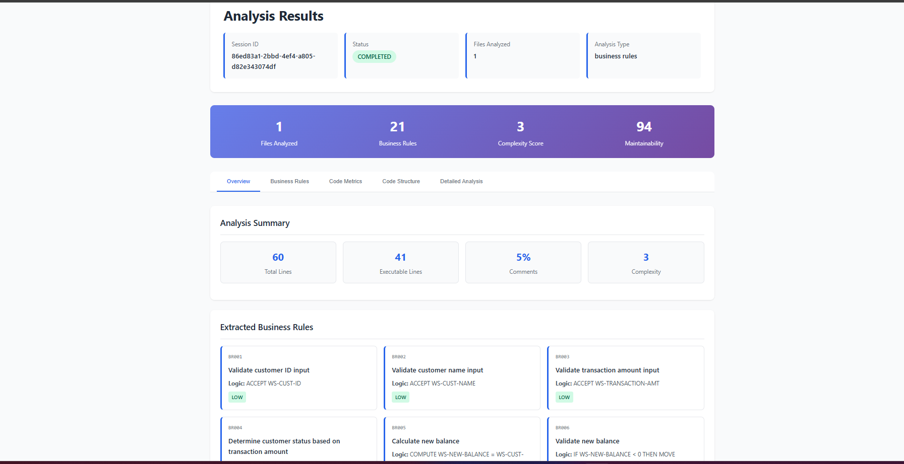

# GenAI Legacy Code Understanding & Risk Analyzer

## 📋 Project Overview

**GenAI Legacy Code Understanding & Risk Analyzer** is an AI-powered system designed to automate the analysis of legacy enterprise source code, with a strong focus on **COBOL-based systems**. The platform extracts business rules, assesses migration risks, and recommends actionable modernization strategies to support large-scale digital transformation initiatives.

---
## 🧪 Proof of Concept (POC)

This project includes a **Proof of Concept (POC)** that validates the feasibility of using **Generative AI** to understand and modernize legacy enterprise systems.

The POC demonstrates the ability to:
- Analyze **legacy COBOL source code** automatically
- Extract **business rules** in a structured format
- Perform **quantitative migration risk assessment**
- Recommend **modernization strategies** (refactor vs rewrite)
- Generate **automated documentation and reports**

The POC confirms that GenAI can effectively support **legacy system understanding and modernization decision-making** with minimal manual effort.

## ✨ Key Features

- **AI-Powered Analysis**  
  Leverages Large Language Models (LLMs) via the **Groq API** for intelligent legacy code understanding.

- **Multi-Language Support**  
  Primary support for COBOL, with extensibility for Java, Python, C/C++, C#, and VB.

- **Comprehensive Risk Assessment**  
  Quantitative risk scoring (0–100) with detailed mitigation strategies.

- **Modernization Roadmaps**  
  Actionable recommendations with phased implementation plans.

- **Automated Documentation**  
  Generates complete system architecture and business rule documentation.

---

## 🏗️ System Architecture

```
├── ui/
│   ├── templates/          # HTML templates (Jinja2)
│   └── static/             # CSS, JavaScript, assets
├── src/
│   ├── analyzers/          # Language-specific analyzers
│   ├── extractors/         # Business rule extraction modules
│   ├── llm_integration/    # Groq API integration
│   └── risk_assessment/    # Risk analysis and scoring
├── config/
│   └── settings.py         # Configuration management
└── data/
    ├── uploads/            # User-uploaded files
    ├── outputs/            # Analysis outputs
    └── reports/            # Generated reports
```
## 🧰 Technical Stack

- **Backend:** FastAPI (Python 3.9+)
- **Frontend:** HTML, CSS, JavaScript, Jinja2
- **AI Integration:** Groq API (Llama 3.1-8b-instant)
- **Data Storage:** JSON (file-based)
- **Containerization:** Docker (optional)

---

## 🚀 Getting Started

### Prerequisites
- Python 3.9 or higher
- Groq API Key
- Minimum 500MB free disk space

---

### Installation

#### Clone the Repository
```bash
git clone https://github.com/yourusername/genai-legacy-analyzer.git
cd genai-legacy-analyzer
```
### Set Up Virtual Environment
```
python -m venv venv
source venv/bin/activate   # Windows: venv\Scripts\activate

```
### Install Dependencies
```
pip install -r requirements.txt
```
### Configure Environment Variables
```
cp .env.example .env
```
### Edit .env:
```
GROQ_API_KEY=your_api_key_here
```
### Run the Application
```
python main.py
```

### Or using Uvicorn:
```
uvicorn ui.app:app --reload --host 127.0.0.1 --port 8000
```
### 🐳 Docker Deployment
```
docker build -t legacy-analyzer .
docker run -p 8000:8000 --env-file .env legacy-analyzer
```
### 📊 Features & Capabilities
## 1. Business Rule Extraction

Automatic identification of business rules

Structured output (ID, description, logic, inputs, outputs)

Source-level traceability

Duplicate rule detection

Example Output
```

{
  "business_rules": [
    {
      "id": "BR001",
      "description": "Validate customer ID input",
      "logic": "ACCEPT WS-CUST-ID",
      "complexity": "low",
      "inputs": ["WS-CUST-ID"],
      "outputs": [],
      "dependencies": [],
      "source_file": "testing.cbl",
      "language": "COBOL"
    }
  ]
}
```
## 2. Migration Risk Assessment

Quantitative scoring (0–100)

Categories: Technical Debt, Dependencies, Complexity, Business Impact

Mitigation strategies per risk

Risk Levels

0–30: LOW – Safe for refactoring

31–60: MEDIUM – Requires planning

61–100: HIGH – Consider rewrite or replacement

## 3. Modernization Strategy Recommendations

The system evaluates multiple modernization approaches and recommends the most suitable strategies based on technical risk, business impact, and system complexity.

| Strategy    | Description                    | Best For                             | Risk Level |
|------------|--------------------------------|--------------------------------------|------------|
| Refactor   | Improve existing code structure | Stable systems with low complexity   | Low        |
| Retire     | Replace with COTS solutions     | Non-core, high-maintenance systems   | Medium     |
| Rehost     | Containerize legacy applications| Deployment-heavy legacy environments | Low–Medium |
| Rewrite    | Complete system rebuild         | Critical, unsupportable systems      | High       |
| Replatform | Migrate to modern platforms     | Platform-dependent applications     | Medium     |

The top **three strategies** are automatically recommended based on analysis results.

---

## 4. End-to-End Analysis Pipeline

The complete analysis workflow follows a structured, automated pipeline:

```text
Upload Files
   ↓
Pre-processing
   ↓
AI-Based Code Analysis
   ↓
Business Rule Extraction
   ↓
Migration Risk Assessment
   ↓
Modernization Strategy Recommendation
   ↓
Report Generation
   ↓
Results Visualization

```

### Supported Analysis Types

business_rules

risk_assessment

modernization

full_analysis (default)



### 🔧 Configuration
```
API Configuration (config/settings.py)
from pydantic_settings import BaseSettings

class Settings(BaseSettings):
    GROQ_API_KEY: str
    GROQ_MODEL: str = ""

    MAX_FILE_SIZE: int = 10_485_760
    SUPPORTED_EXTENSIONS: list = ['.cobol', '.cbl', '.cob', '.java', '.py']

    AI_ANALYSIS_ENABLED: bool = True
    MAX_BUSINESS_RULES_PER_FILE: int = 50

    class Config:
        env_file = ".env"

settings = Settings()
```
### 📈 Performance & Scalability
```
Metric	Value
Files per Session	1–50+
Rules per File	6–20+
Analysis Time per File	2–5 seconds
Memory Usage	< 500MB

Scalability Features

Async background processing

Batch file analysis

Modular analyzer design
```
### 📋 API Documentation
```
Upload Files: POST /upload

Get Results:
GET /results/{session_id}
GET /api/results/{session_id}

Download Report: GET /download/{session_id}

System Status: GET /api/status
```
### 🎯 Use Cases
```
Legacy System Modernization

Technical Debt Assessment

Compliance Documentation

Developer Onboarding
```
### 🔒 Security & Compliance
```
Encrypted API keys

Session-based isolation

Automatic file cleanup

Audit logging and versioning
```
### 🧪 Testing & Quality Assurance
```
pytest tests/ --cov=src --cov-report=html


Expected Coverage

Unit: 85%+

Integration: 70%+

E2E: 60%+
```
### 🚀 Roadmap
```
v1.2 (Q1 2026)

Dependency graphs

Collaboration features

Plugin marketplace

v2.0 (Q2 2026)

Multi-LLM support

Automated test generation

CI/CD integration

v3.0 (Q4 2026)

Predictive maintenance

Automated refactoring

Compliance intelligence
```
### 📄 License
```
MIT License
© 2025–2026 GenAI Legacy Analyzer Team
See LICENSE for full terms.
```
### 📚 Citation
```
@software{genai_legacy_analyzer_2025,
  title = {GenAI Legacy Code Understanding & Risk Analyzer},
  author = {SajithMelethil},
  year = {2025},
  url = {https://github.com/yourusername/genai-legacy-analyzer}
}
```
### 📞 Contact & Links
```
GitHub: https://github.com/SajithMelethil

Documentation: https://genai-legacy-analyzer.readthedocs.io

Last Updated: January 2026
Version: 1.0.0
```


